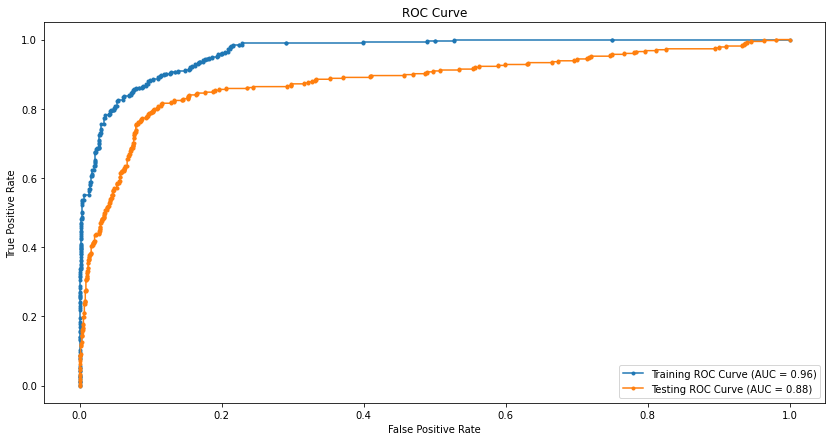

# Project Overview
In this project, I used classification modelling to predict the churn rate of customers in the[text](bigml_59c28831336c6604c800002a.csv)   telecom data set.
In addition I created a powerpoint to help explain the benefits of my model.
# Business Problem
High customer churn rates leads to great loss for a business. It reduces their market share and potential gains,
allows competitors to gain an advantage by poaching their customers and forces the business to increase marketig costs in order to attract new customers. Thus being able to predict whether a customer will churn is crucial for 
any business especially now, with the evolution of AI and technology within the tech industry.
# Solution
Through the use of advanced algorithms and iterative modelling techniques such as Logistic Regression, Decision Tree Classification and Random Forest Classification. I was able to generate a modell that can predict up to 80% of customers who are likely to churn with an accuracy of 86%.
# Model Metrics
My top model was a Random Tree Classification modell based on recall and roc_auc score. Due to the high cost of failing to predict a customer who might , I determined that recall score was more important than precision. In addition roc_auc indicates how well the model can distinguish between the two classes (e.g., churn vs. no churn) and gives insights into both true positives and false positives.
# Results
best_overall_model = RandomForestClassifier(
    n_estimators=100,
    max_depth=10,
    max_features=35,
    min_samples_leaf=2,
    min_samples_split=5,
    ccp_alpha=0.01,
    random_state=333
)

best_overall_model.fit(X_train_resampled, y_train_resampled)

Best Recall Score from GridSearchCV: 0.8515909090909091

Best ROC-AUC Score from GridSearchCV: 0.9438613172541744

Training Metrics:

Confusion Matrix:
 [[509  50]
 [ 75 484]]

Accuracy Score: 0.8881932021466905

F1 Score: 0.8856358645928638

Precision: 0.9063670411985019

Recall: 0.8658318425760286

ROC-AUC Score: 0.9641130180714987

Testing Metrics:

Confusion Matrix:
 [[1982  309]
 [  66  309]]

Accuracy Score: 0.8593398349587397

F1 Score: 0.622356495468278

Precision: 0.5

Recall: 0.824

ROC-AUC Score: 0.8797276298559581

!

[alt text](image-1.png)

